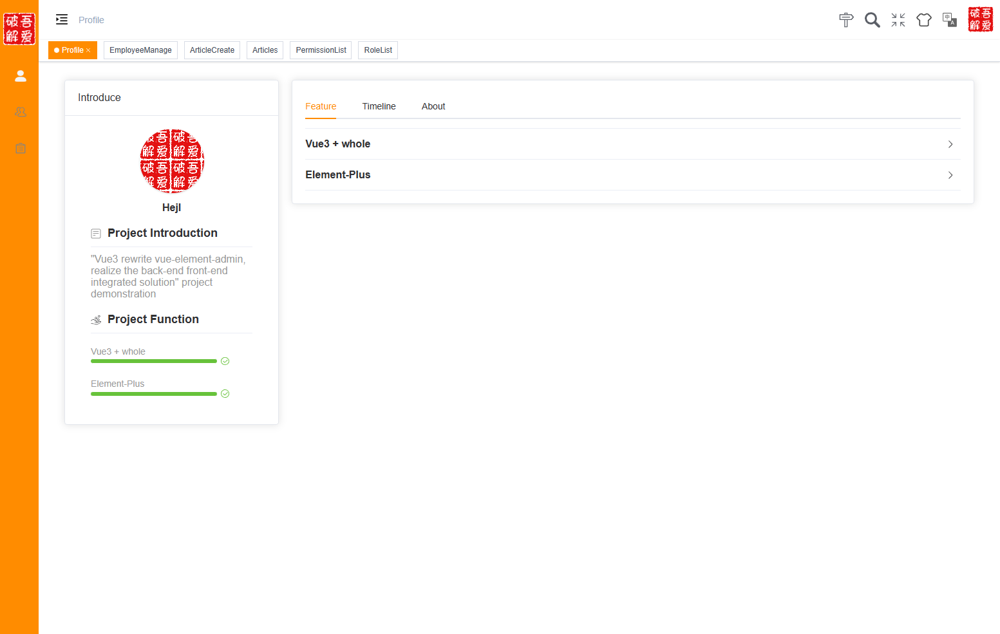

# A Simple Content Manage System

## 前端系统


## 后端系统


# 特性

* 最新的前后端依赖版本和构建方式(截至2022年12月)
* 国际化支持
* 基于RABC模型的前后端权限控制系统


# 预览





# 使用方式

依次运行以下命令可最快体验到效果:
```sh
git clone https://github.com/hjlarry/flask-vue-cms.git
cd flask-vue-cms/backends
python3 -m venv .venv
# windows下
.venv/Script/active
pip install -r requirements.txt
flask --debug run
```
`http://localhost:5000`打开管理系统  
`http://localhost:5000/docs`打开apiflask自动生成的api文档

前端二次开发方式:
```sh
cd flask-vue-cms/admin_with_vue3
npm install
npm run dev
```

开发完成后，可通过`npm run build-only`生成静态文件，直接复制至backends文件夹中

建议修改配置，使用mysql和redis等提升性能，当前使用的sqlite和shelve是为了便于开发

# 参考

1. 旧版本项目基于vue2和flask0.12版本开发，[点此查阅](https://github.com/hjlarry/flask-vue-cms/tree/flask0.12.2+vue2.9.3)
2. [vue-element-admin](https://github.com/PanJiaChen/vue-element-admin)
3. 慕课网前端[课程](https://coding.imooc.com/class/542.html)